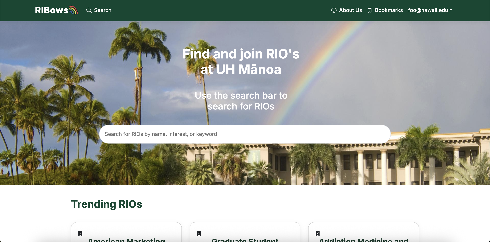
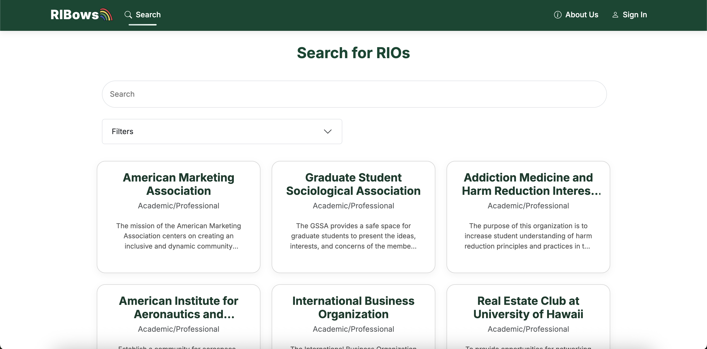
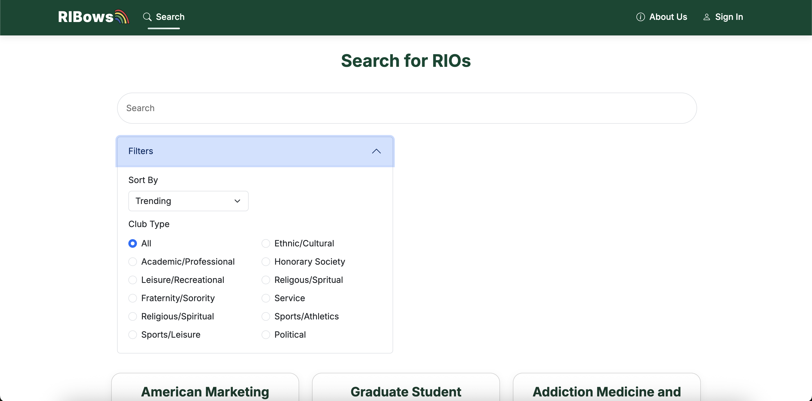
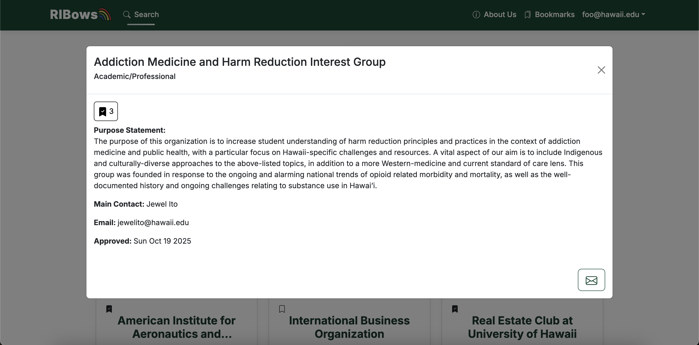
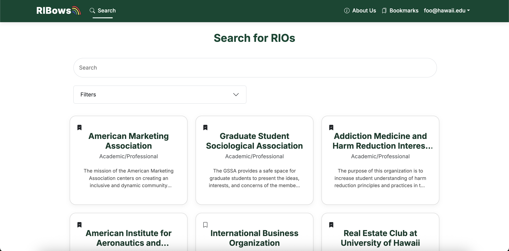

# RIBows
RIBows is a website built by University of Hawaii at Manoa (UHM) students, for UHM students, to easily search for, discover, and join Registered Independent Organizations (RIOs). RIBows gives users the flexibility to browse trending RIOs or search for specific RIOs based on interests or keywords. If a user sees an RIO that interests them, they can use the bookmarking feature to save the RIO for easy future reference. Once a user finds an RIO they want to join, simply clicking the “apply” button allows them to send an application to the RIO admin, simplifying the process of finding and joining an RIO that matches your interests.

## Contributions
While I was involved with various bug fixing and UI improvements throuhgout the site, I mainly contributed to the RIBows search page. The search page connects to the Prisma database to fetch all of the different RIOs, and displays them in a grid like pattern. For the search bar, the userinput immediately gets parsed and sorts the RIOs first by title, then by description to match what the user is searching.

Along with the search bar, I also implemented the filter feature and bookmark button. For the filter, the RIO's are automatically sorted by popularity, which is sorted from highest amount of bookmarked clubs to lowest. Through the filter, you are able to sort the list from the default trending, to alphabetical (a-z, z-a), newest clubs, and oldest clubs. The filter also allows the user to sort by club type, including interests of Academic/Professional, Fraternity/Sorority, Political, Sports/Leisure, and more. 

As for the bookmark button, I added a feature that has the button only show up if the user is logged in. If the user is logged in, the page also fetches the user's bookmarked RIO's and then fills the button accordingly on the search page. 

Another feature that I contributed to was the RIO card page. When an RIO card is clicked, a bigger card pops up containing more information, including a full purpose statement, main contact, and an email button that allows you to send a request to join the club. 

Aside from the RIO cards, I created the UI for the feedback page that allows the user to give feedback through a Google form. 

## Reflections
From this project I learned a lot not only coding wise, but also how to operate, work, and manage a team. For coding, this was my first time using both Javascript, React, and Prisma in a project, so there was a big learning curve before I was able to get the ball fully rolling. Coding aside, doing this project allowed me to get familiar with version control, as this was also my first time using Git with a team. Learning how to properly create new branches to avoid conflict, as well as managing merge conflicts and choosing what parts of the code to keep and to discard was a new learning experience for me. 

During this project, I also played the role of team leader, which meant organizing and leading meetings as well as communicating with team members to make sure that everyone is on the same page. Before I fully adapted to the position, it was a bit difficult knowing which parts of the project were to be assigned to who and it also was unclear what each member accomplished in between team meetings. After realizing this, I made sure that each. member gave updates for what they accomplished as well as created check lists for tasks that needed to be finished before the next deadline. 

This experience allowed me to grow both technical skills with coding and version control, and soft skills with leadership and communication. With the help of a great team, we were able to make a website that serves all UH students and allows them to further explore their interests and live a fuller university life. 

Link to the github.io page <a href="https://ri-bows.github.io/">here</a>