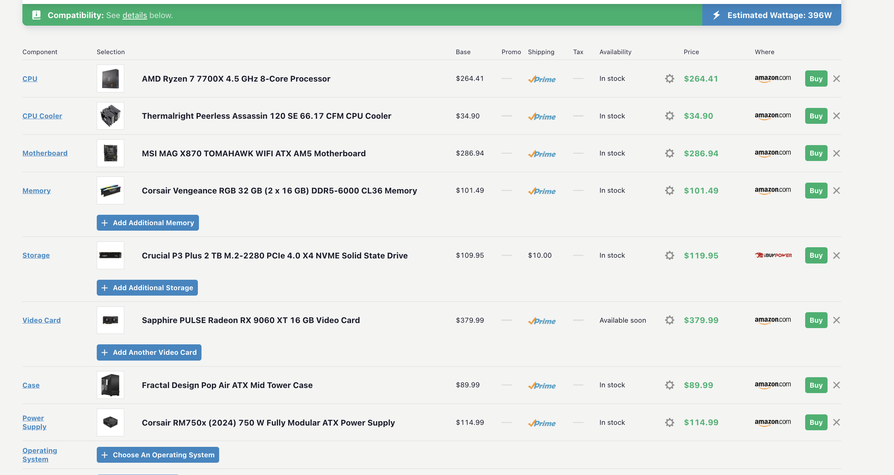

I had always wanted to play video games on a PC and also wanted an upgrade from my old laptop, so in Summer 2025, I made the bold decision to build my own PC. Building your own PC requires you to do research on each invidual part, and on top of that allows you to save some money. The PC I built uses a MSI AM5 motherboard, Radeon RX 9060 XT, 32 GB of memory, and an AMD Ryzen 7 processor. 

The first thing I did was do research. When building a PC, after figuring out your budget, you then plan out how much you want to spend on each part. Certain parts like the graphics card or motherboard are important so you need to take into consideration how much of your budget you want to alot to those parts, while still keeping the rest of the build, like monitor, fans, case, or ram good enough. For organization help, I used a website called pcpartspicker. It helped me choose parts that work well with each other as well as shows the best part you can get for your buck. 

[Here is my pcpartspicker build.](https://pcpartpicker.com/list/LNmxqH)

After researching and buying the parts, the next is assembling your PC. This part took a while, as you had to be careful when installing certain parts as damaging them could mean ruining your PC. Also, when connecting all the parts together (for exmaple, from motherboard to to power supply), you need to make sure each cable goes into the correct spot and is secured properly. After plugging everything in, you see if you did everything correct if your PC starts up. I ran into some issues with this part, but after troublshooting a bit, I realized that I didn't plug in my cables all the way and had put some connectors in the wrong spots.

Once your PC boots up, you still need to download the correct OS system and update your drivers correctly. This also took some time as you have to nagivate through the Motherboards BIOS UI to correctly configure settings and make sure that everything is up to date. I had to download Windows 11 through a different computer and connect it to my new PC via hard drive. 

While the whole process is by no means complicated, it was more tedious than I thought. Building my own PC taught me more about computers in general; what kind of hardware is needed for a modern computer and the different software required to make a computer perform correctly. I also learned a lot more about troubleshooting and how to effectively tackle problems that you may encounter. While I am more focused on software jobs rather than hardware ones, the knowledge and experience I got from building my own PC will help me gain a better understanding of how programs run and how to better deisgn programs based on a PC's hardware limitations. 