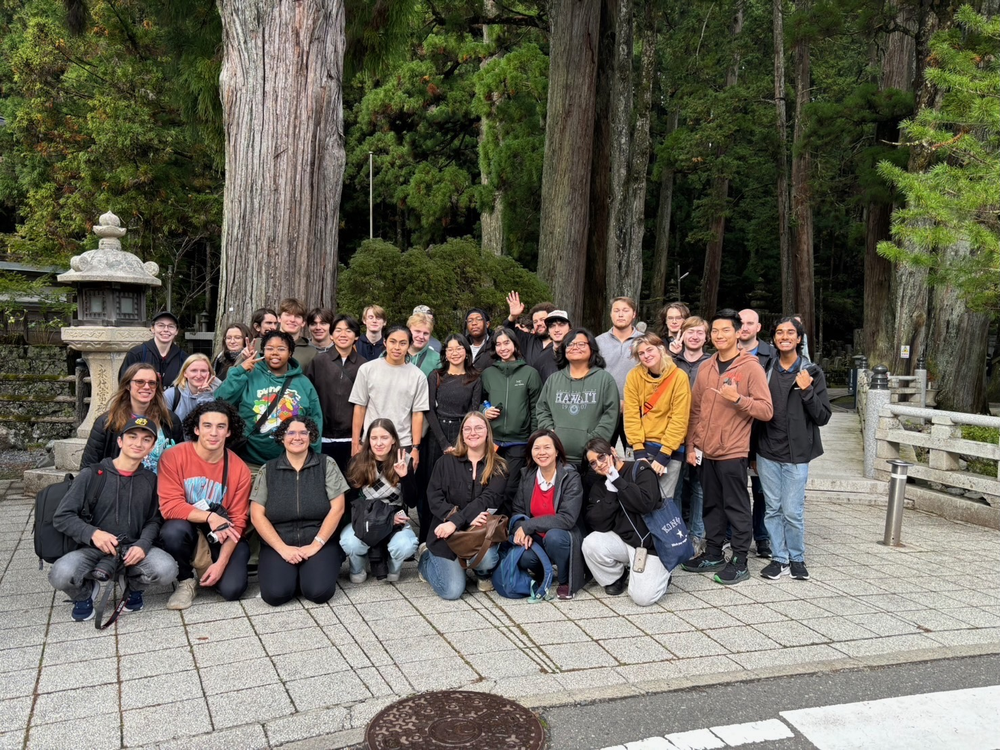
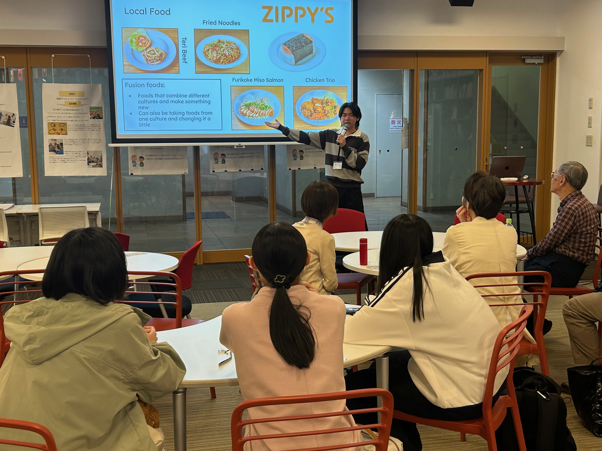
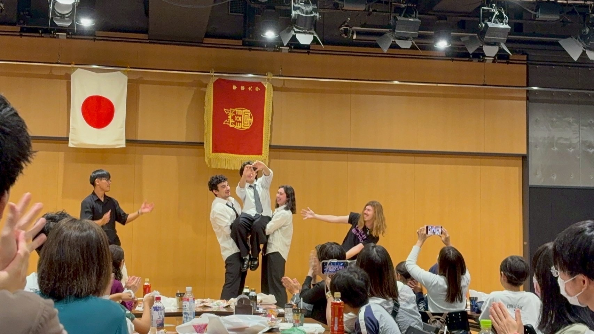
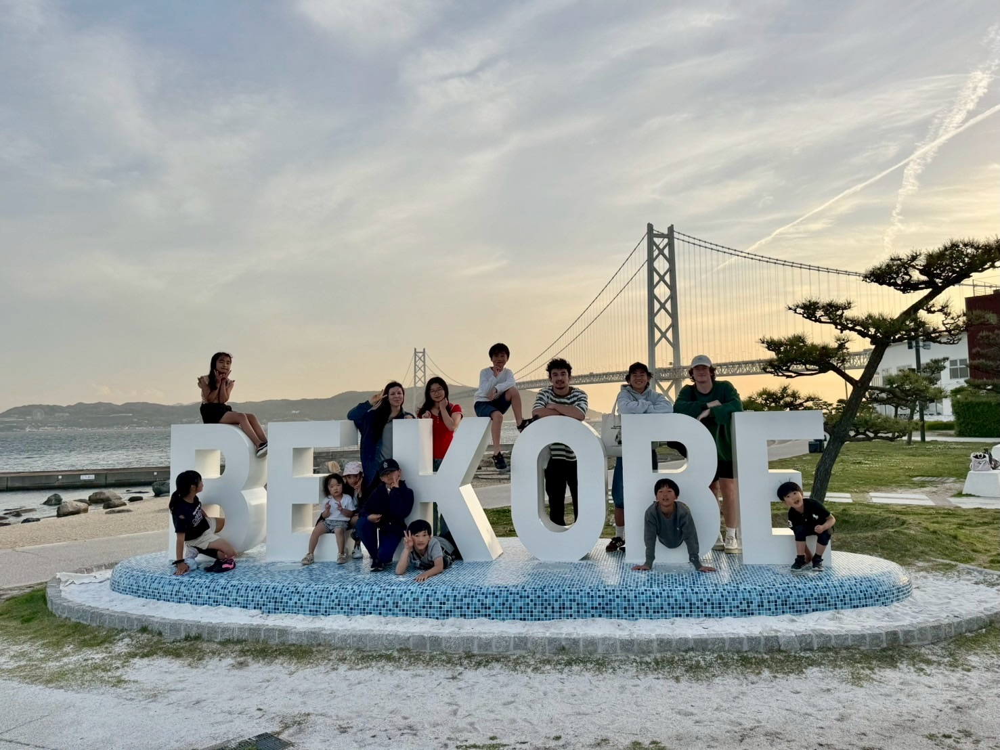

  

During my year-long study abroad in Kobe, Japan, I went through various endeavors and experiences. I had to adapt to a completely new environment and had to learn how to navigate daily life in a foreign country. I was also living with a host family, which meant not only coordinating schedules and adjusting to a different household culture, but also communicating across language and cultural differences. Despite the various challenges I faced, I truly grew a lot, as I had to overcome many obstacles and perform various tasks throughout the program. 

  

One of the tasks I had to do was creating slideshows and presenting to not only students, but also parents and faculty as well. I had to present both English and Japanese slide shows, which meant doing research and presenting both in their respective languages. Another task I had was working as an English practice partner for foreign students. Every shift, I was assigned around 4 Japanese students and had to communicate with them to hone their English skills. While this sounds relatively easy, it was more challenging than I thought. Each member of the group has varying skill levels of English, so in order to keep everyone engaged, you have to choose a topic that everyone can respond to. On top of that, some members of the group are more willing to participate in others, so to achieve a nice balance between all of the students, you need to make sure they all have equal chances to talk, and sometimes you need to focus on more students than others. 

Along with being an English practice partner, getting along with the other study abroad students was a task in itself. As an international study abroad program, people from all parts of the world come together, representing diverse backgrounds and personalities. Working together with them, whether that be through school projects, field outings, and excursions, or even coordinating a dance routine for the end of the year celebration, all came with their ups and downs. I learned a lot about how to deal with different people, and have made plenty of precious friends and unforgettable memories along the way. 

You might be asking, how exactly was this a project? 

Well, the definition of a project is a type of undertaking, typically involving research or design, that is carefully planned to achieve a specific objective.

I had planned this study abroad all the way since junior year of high school, and in doing so and partaking in it, I was able to grow so much as a person and take in brand new experiences that are unattainable in any other way. I had done a lot of research both in high school and my freshman year of college in order to make this happen, and had participated in order to learn more about the world. Staying with a host family that speaks a completely different language, dealing and interacting with people from different backgrounds and cultures, and learning how to get along with them; these experiences, and the skills and memories gained from this study abroad, are truly the fruits of this project. I became more independent and resourceful, more comfortable communicating with people in general, even with language barriers, and I definitely became more confident stepping outside of my comfort zone. It was challenging at times, but it taught me how to adapt quickly, stay open-minded, and take initiative, skills that I’ve carried with me ever since, and plan to take with me into the future. 

